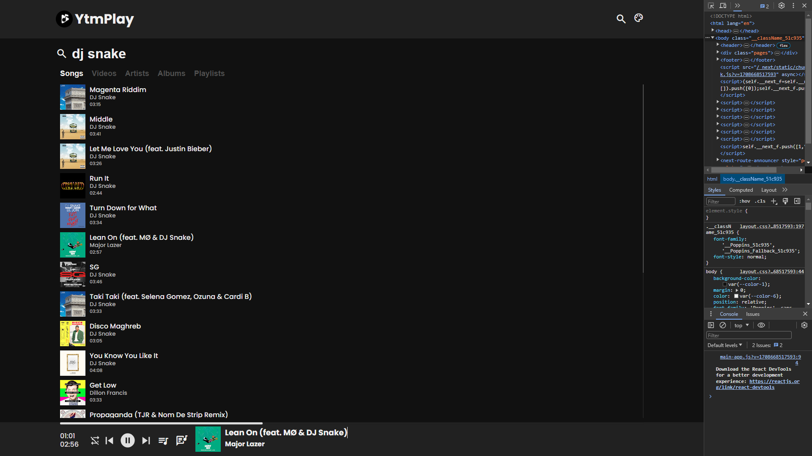
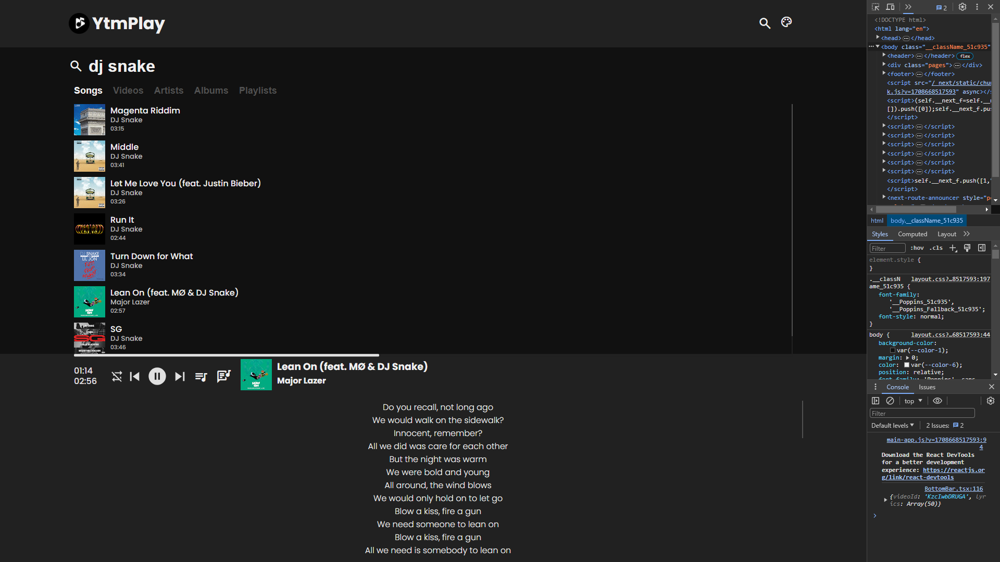
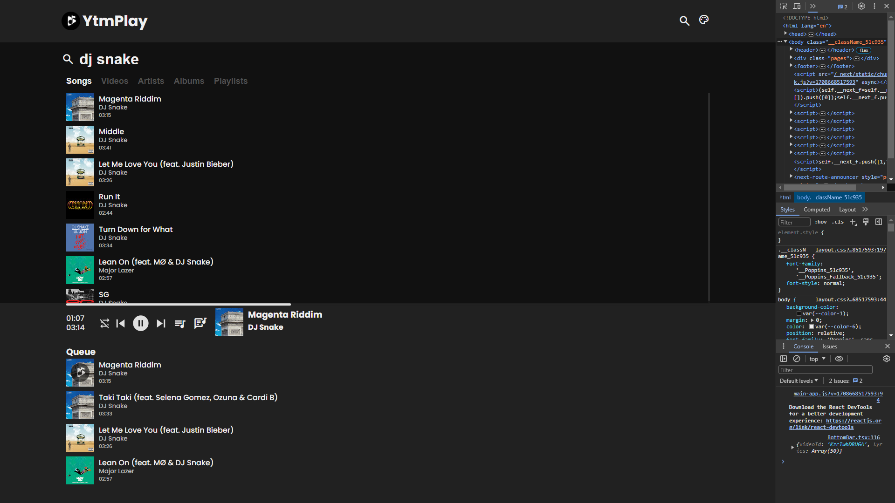
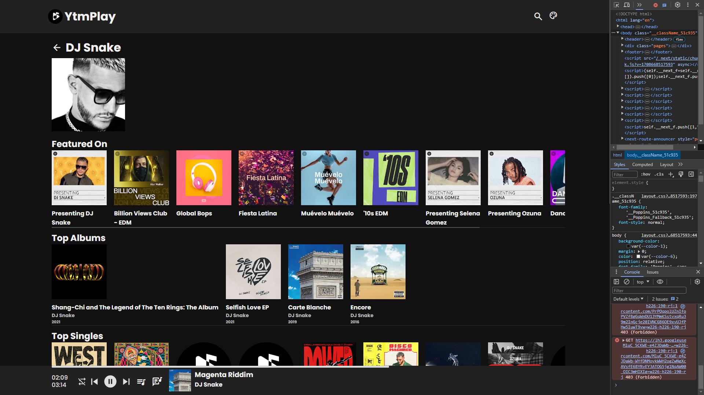
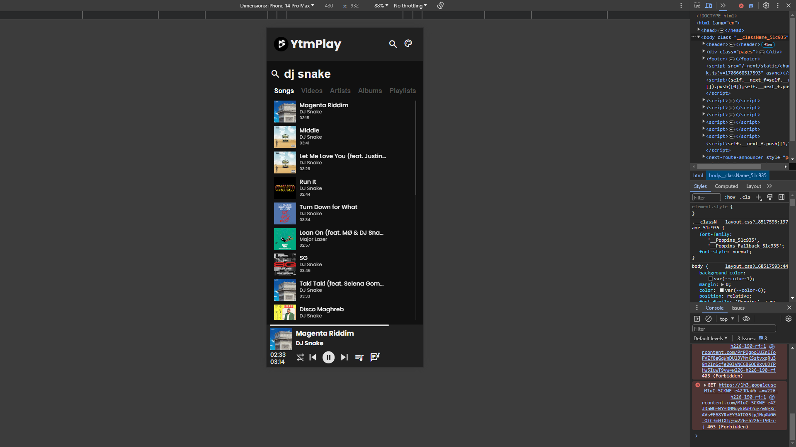
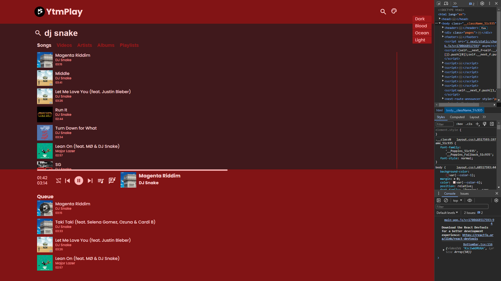

# YtmPlay

YtmPlay is an online web music player built with Next.js and React, styled with vanilla CSS.

## Features

- Search and play music from YouTube Music.
- User-friendly interface.
- Responsive design for mobile and desktop.
- Lyrics for songs from YouTube Music.
- Queue
- Quick Play
- Multiple Themes (Dark, Blood, Ocean, Light)

## Technologies Used

- Next.js
- React
- Vanilla CSS

## Getting Started

1. Clone the repository:

   ```bash
   git clone https://github.com/teleport-1254/ytmplay
2. Navigate to the project directory:

   ```bash
   cd ytmplay
3. Install dependencies:

   ```bash
   npm install
4. Run the development server:

   ```bash
   npm run dev
5. Open http://localhost:3000 in your browser to see the application.

## Deployment
Application is deployed on Vercel for demo [here](https://github.com/teleport-1254/ytmplay)

## Screenshots







## Disclaimer
This is a personal project and the contents of the project are not funded, authorized, or in any way associated with YouTube, Google LLC or any of its affiliates and subsidiaries.
Any trademark, service mark, trade name, or other intellectual property rights used in this project are owned by their respective owners.